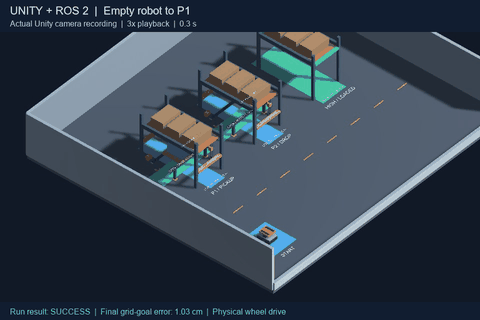
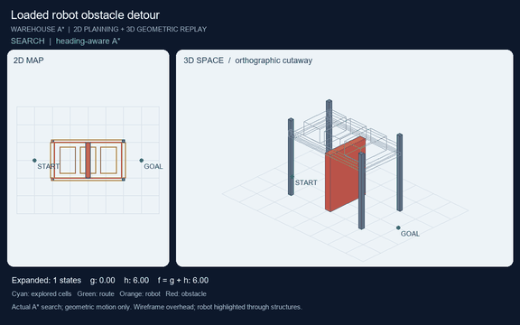

# Load-Aware Warehouse Robot

**A route that works for an empty robot may not work when it carries a load.**

This project helps a warehouse robot choose a route based on its size, lift height, and cargo. The goal is to move through rack passages without hitting the shelves or getting stuck.

Python runs A* to find a path, ROS 2 controls the robot, and Unity lets us test it in a warehouse.

## Demos

### Driving to a pickup point in Unity

This is a recording from Unity. ROS 2 guides the empty robot from its starting position to pickup point P1, where it stops. Automatic pickup and loaded transport are not part of this demo yet.

[Watch the full-speed video](outputs/unity-basic/unity-basic-demo.mp4)

### Finding a detour while carrying a load

This Python simulation shows A* searching for a path, followed by 2D and 3D views of a loaded robot going around an obstacle. It demonstrates the planning algorithm; it is not a Unity recording.

