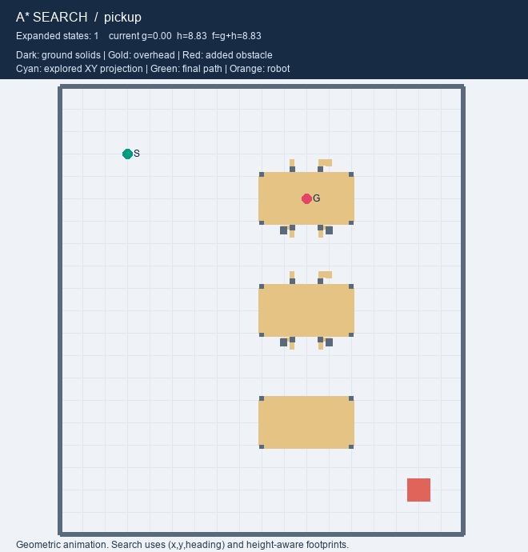

# Load-Aware Warehouse Robot

这是一个用 **Unity + ROS 2** 做的仓储机器人项目。

它要解决的问题很直白：同一台小车，空载时能钻过低货架，顶起货物后却会变高、变宽，原来能走的路可能会撞上货架。因此规划路径时不能只看小车在地面上占多大面积，还要知道它现在有没有载货、顶撑升了多高。

项目目前已经跑通：

- Unity 中的仓库和物理差速小车；
- ROS 2 控制车轮和顶撑，Unity 返回里程计、轮速和举升状态；
- 从 Unity 碰撞体导出带高度信息的规划地图；
- 根据空载、升起空载和载货状态运行 A*；
- ROS 2 发送规划路径和 `/cmd_vel`，Unity 小车使用 WheelCollider 真正跑到 P1。

动态取货、载货后驶向 P2、自动放货和雷达避障仍在开发中。详细进度见 [项目状态](docs/PROJECT_STATUS.md)。

## Demo

### Unity + ROS 2 物理闭环

下面不是预先画好的动画。路径由 ROS 2 侧规划和跟踪，速度通过 `/cmd_vel` 发给 Unity；小车由两个 WheelCollider 的扭矩和地面摩擦驱动，再通过 `/odom` 把实测位置反馈给 ROS 2。


本次空载 `RobotStart → Pickup_P1` 测试路线长约 9.94 m，最终位置误差约 1 cm。测试方法和原始结果见 [ROS–Unity 联合测试](docs/ROS_UNITY_TEST.md) 与 [run_report.json](outputs/ros_unity/run_report.json)。

### 2D A* 搜索与载货绕障

这个动画展示 A* 搜索过程以及载货机器人遇到临时障碍后的绕行。它是 Python 几何仿真，不是 Unity 录像；规划器仍然使用八个朝向和三维高度分层碰撞约束。


空载前往 P1 的 2D 演示：



仓库中还保留了低通道、高通道和取货等其他演示的生成工具，可按需重新输出。

## 项目是怎么工作的

```text
Unity 仓库碰撞体
        ↓ 导出
带高度、朝向和任务点的规划地图
        ↓
Load-aware A* 选择空载或载货地图
        ↓ /planned_path
ROS 2 路径跟踪器
        ↓ /cmd_vel
Unity WheelCollider 差速底盘
        ↓ /odom、/joint_states
ROS 2 根据真实运动继续闭环控制
```

顶撑是另一条闭环：

```text
ROS 2 /lift/command
        ↓
Unity 限速移动 LiftPlatform
        ↓
/lift/state + /lift/at_target
```

ROS-TCP Endpoint 的作用类似翻译和转发站：Unity 使用 C# 消息类，ROS 2 使用标准消息定义，Endpoint 把双方的数据通过 TCP 接起来。

## 仓库怎么建的

仓库不是精细美术模型，而是为了验证规划和碰撞而建的功能模型。场地约为 20 × 18 m，主要包括：

- 三排架下可通行货架；
- P1 取货位和 P2 放货位；
- 1.0 m 低入口，只允许顶撑收回的小车通过；
- 2.4 m 高通道，允许载货机器人通过；
- P1/P2 的开放中心双轨输送台；
- 一个用于绕障测试的临时障碍。


P1/P2 中间不是实心平台，而是两条承托轨道。小车先在外面调整好方向，再进入中间的槽，从货物下面举升；槽内空间窄，因此规划器禁止原地旋转。


所有关键结构使用 BoxCollider。Unity Editor 工具会导出当前保存场景中的碰撞盒、起点、P1/P2 和机器人尺寸，再生成 0.025 m 分辨率的规划地图。完整尺寸和生成方式见 [仓库环境说明](docs/WAREHOUSE_ENVIRONMENT.md) 与 [规划地图说明](docs/PLANNING_MAP.md)。

## 机器人怎么建的

机器人是一个双轮差速底盘，带可上下移动的承载平台：

| 参数 | 当前值 |
|---|---:|
| 质量 | 40 kg |
| 轮半径 | 0.18 m |
| 左右轮距 | 0.78 m |
| 底盘碰撞体 | 0.70 × 0.28 × 0.90 m |
| 举升行程 | 0–0.35 m |
| 空载收回高度 | 约 0.734 m |
| 载货总高度 | 约 1.804 m |
| 载货平面包络 | 1.70 × 1.40 m |


左右轮由 WheelCollider 接触地面。控制器计算目标轮速，再用轮位置处的刚体前向速度做 PI 反馈，通过 `motorTorque` 和 `brakeTorque` 控制车轮。代码没有直接修改机器人 Transform，也没有直接把刚体速度写成目标速度。

顶撑目前使用受控位置运动：ROS 2 给出目标高度，Unity 按最大速度移动平台并返回实际伸长量。三级伸缩柱主要用于把机械结构表达清楚，不是假装完成了完整液压或丝杠动力学仿真。机器人模型细节见 [ROBOT_MODEL.md](docs/ROBOT_MODEL.md)。

## 差速运动学

设机器人前进速度为 $v$，绕竖直轴的角速度为 $\omega$，轮半径为 $r$，左右轮中心距离为 $L$。左右轮目标角速度为：

$$
\omega_L = \frac{v-\omega L/2}{r}, \qquad
\omega_R = \frac{v+\omega L/2}{r}
$$

反过来，根据左右轮角速度可以得到底盘速度：

$$
v = \frac{r}{2}(\omega_R+\omega_L), \qquad
\omega = \frac{r}{L}(\omega_R-\omega_L)
$$

因此：

- 两个轮子同速同方向，小车直行；
- 右轮比左轮快，小车向左转；
- 两个轮子等速反向，小车原地旋转。

Unity 坐标系和 ROS 坐标系方向不同。当前平面换算为：

$$
x_{map}=z_{Unity}, \qquad y_{map}=-x_{Unity}, \qquad
\theta_{map}=-\theta_{Unity}
$$

当前出生点还带有 map 到 odom 的平移：

$$
x_{map}=x_{odom}-6, \qquad y_{map}=y_{odom}+7
$$

## Load-aware A* 如何避免撞货架

普通二维 A* 只把机器人看成地面上的一个矩形。本项目把机器人拆成多个高度层：

```text
empty         = 底盘 + 收回的顶撑
raised_empty  = 底盘 + 升起的顶撑
loaded        = 底盘 + 升起的顶撑 + 货物
```

只有机器人某个高度层和障碍物高度重叠时，才检查它们在平面上的碰撞。这样就能表达“底盘能从轨道下面经过，但升起的平台或货物会撞到低横梁”。

A* 状态不是简单的 `(x, y)`，而是：

$$
s=(c,r,h), \qquad h\in\{0,1,\ldots,7\}
$$

其中 `c、r` 是栅格位置，`h` 是八个离散朝向。机器人可以向前、倒车，或在允许的位置原地转动 ±45°，不能横着平移。

当前每一步的代价为：

$$
C_{action}=\begin{cases}
d, & \text{前进}\\
1.1d, & \text{倒车}\\
0.18, & \text{转动 }45^\circ
\end{cases}, \qquad g_{new}=g+C_{action}
$$

启发函数使用 octile distance：

$$
h=\max(dx,dy)+(\sqrt{2}-1)\min(dx,dy)
$$

规划器还会检查对角移动是否穿过墙角、转向时的扫掠范围，以及机器人是否企图在 P1/P2 窄槽里旋转。离线验证覆盖成功路线、载货绕障、目标被占用、越界和不可达等情况。算法和结果见 [ASTAR_PLANNER.md](docs/ASTAR_PLANNER.md)。

## ROS 2 话题

| Topic | 方向 | 用途 |
|---|---|---|
| `/cmd_vel` | ROS 2 → Unity | 线速度和角速度命令 |
| `/odom` | Unity → ROS 2 | 实测底盘位置和速度 |
| `/joint_states` | Unity → ROS 2 | 左右轮角位置和轮速 |
| `/lift/command` | ROS 2 → Unity | 顶撑目标伸长量 |
| `/lift/state` | Unity → ROS 2 | 顶撑实际伸长量 |
| `/lift/at_target` | Unity → ROS 2 | 是否到达目标高度 |
| `/planned_path` | ROS 2 → Unity | 规划路径和 Unity 可视化 |

## 快速运行

环境：Windows 11、Unity `6000.6.0f1`、Docker Desktop、ROS 2 Jazzy。

### 1. 运行离线规划和测试

```powershell
.\tools\Build-PlanningMap.ps1 -RunTests
.\tools\Run-AStar.ps1 -Verify
```

### 2. 查看纯 Python 动画

```powershell
.\tools\Run-PythonSimulation.cmd
```

或者：

```bash
python -m warehouse_planning.animation --show
python -m warehouse_planning.animation --scenario detour --show
```

### 3. 运行 ROS 2 + Unity

```powershell
.\tools\Run-RosUnityTest.ps1 -PrepareOnly
```

然后打开 `unity_project`，加载 `Assets/Scenes/WarehouseEnvironment.unity` 并点击 Play，最后执行：

```powershell
.\tools\Run-RosUnityTest.ps1
```

完整步骤、复位保护和结果判断见 [ROS_UNITY_TEST.md](docs/ROS_UNITY_TEST.md)。

## 测试结果

- Python 规划、几何和跟踪测试：18 项通过；
- A* 场景验证：10 个场景结果符合预期；
- Unity Runtime 和 Editor C# 程序集：0 warning、0 error；
- 空载 Start→P1：ROS 2 + Unity WheelCollider 闭环通过；
- 最新记录终点位置误差约 0.0103 m，航向误差约 0.0055 rad；
- 规划成功不等于真实机器人安全认证，载货动态任务仍需单独验证。

## 目录

```text
unity_project/       Unity 场景、机器人控制和可视化
warehouse_planning/ Python 地图、A*、跟踪器和动画
ros2_ws/             ROS 2 举升控制包
config/              机器人模式和规划参数
maps/                Unity 导出几何与生成地图
tests/               自动测试
tools/               一键生成、规划和联调脚本
outputs/             规划结果、GIF 和 ROS–Unity 实测轨迹
docs/                建模、算法、SOP 和验证文档
```

## 当前限制与下一步

当前 P1 的货物还没有实现动态 attach/detach。因此载货地图和载货 A* 已经完成，但完整的“到 P1—举升取货—载货到 P2—下降放货”还不能算完成。

下一步按这个顺序推进：

1. 实现货物连接、释放和 `/load/state`；
2. 在 Unity 中执行载货 P1→P2 路径；
3. 用任务状态机串联规划、对接、举升、运输和放货；
4. 添加二维雷达或前向检测，实现安全停车；
5. 时间允许时加入临时障碍在线重规划。

内部恢复、排错和维护步骤见 [INTERNAL_SOP.md](docs/INTERNAL_SOP.md)。

## License

[Apache License 2.0](LICENSE)
