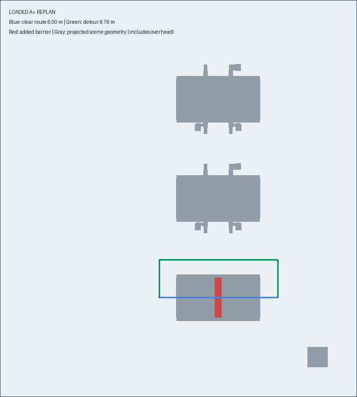

# A* 路径规划与验证

要让 Unity 小车实际运行规划路径，请使用 [ROS–Unity 联合测试 SOP](ROS_UNITY_TEST.md)。下文保留离线规划接口与验证说明。

已把地图阶段的参考 A* 完善为可直接调用的规划入口，针对当前真实仓库进行场景验证。
运行入口：`warehouse_planning/planner.py`；搜索核心：`warehouse_planning/astar.py`；独立几何校验：`warehouse_planning/validation.py`。

## 运行

在项目根目录：

```powershell
# 空载：起点到 P1
.\tools\Run-AStar.ps1

# 载货：P1 到 P2
.\tools\Run-AStar.ps1 -Mode loaded -Start Pickup_P1 -Goal Dropoff_P2

# 完整场景验证
.\tools\Run-AStar.ps1 -Verify
```

通用 Python 命令：

```bash
python -m warehouse_planning.planner --mode empty --start RobotStart --goal Pickup_P1
python -m warehouse_planning.planner --mode loaded --start Pickup_P1 --goal Dropoff_P2
python -m warehouse_planning.planner --mode loaded --start=-1,-5,0 --goal=5,-5,0 --overrides config/temporary_high_block.json
python -m warehouse_planning.planner --verify-suite
python -m unittest discover -s tests -v
```

输入可以是目标名或 `x,y,yaw`。所有坐标属于 **map**，yaw 单位为弧度，必须是 45° 整数倍；不是 Unity 坐标或现有 `/odom` 坐标。
使用 `--output <目录>` 改输出位置，`--max-expansions` 设置单次搜索预算。地图来源和配置哈希不匹配时拒绝规划，需按 [地图说明](PLANNING_MAP.md) 重新生成。

## 搜索算法

状态为 `(column,row,heading)`，八个朝向，不允许差速机器人横移。
每个状态可沿当前朝向前进一格、倒车一格，或在允许原地转向处转 ±45°。
位置有效性取自对应状态/朝向的分层配置空间图；对角前进还检查两个相邻正交格，禁止穿角。
转向检查旋转扫掠层，P1/P2 镂空槽内另有禁止转向规则。

代价为：前进距离 + 倒车距离×1.1 + 转向步数×0.18。
启发函数为 octile distance，不加入会破坏可采纳性的额外估计。
优先队列、最佳累计代价及父指针用于搜索，过期队列项跳过，找到更低代价可重新入队。
在默认非负代价和搜索成功条件下，求解的是此离散动作图上的最小代价路径；不代表连续空间中任意曲线路径的全局最优。

输出 `segments` 只合并同朝向、同前进/倒车动作的连续直线段，不改变路线；转向点全部保留。
没有做任意 line-of-sight 平滑，因为它可能破坏窄槽朝向约束或引入横移。

## 输出与失败状态

单次规划生成 `outputs/astar/path.json` 和 `path.csv`。

- JSON：状态、原始目标、所属模式/场景状态、栅格路径、map 位姿、前进/倒车/转向段、长度、代价、展开数、搜索耗时和碰撞验证结果。
- CSV：`map_x,map_y,yaw_rad,qz,qw`；保留重复位置的转向点，没有生成速度或时间戳。
- 请求位置落到所属格子中心，最终精确对接仍需要控制器完成；不要直接把 map 位姿作为 odom 位姿使用。

失败区分 `START_BLOCKED`、`GOAL_BLOCKED`、`OUT_OF_BOUNDS`、`UNSUPPORTED_HEADING`、`UNREACHABLE`、`SEARCH_BUDGET_EXCEEDED` 和无效请求。
预算耗尽不等于不可达。失败返回空路径，单次 CLI 在读取地图前会清空旧输出，避免把上次路径误当本次结果。

## 实际地图验证结果

2026-09-11：10 个场景达到预期结果；完整报告为 `outputs/astar/verification_report.json`。

| 场景 | 结果 | 路径长度 |
|---|---|---:|
| 起点→P1，空载 | 成功 | 9.94 m |
| P1→P2，载货 | 成功 | 5.00 m |
| 空载穿低货架 | 成功 | 6.00 m |
| 载货穿高货架 | 成功 | 6.00 m |
| 升高空载穿高货架 | 成功 | 6.00 m |
| 高通道加入挡板后载货重规划 | 成功绕行 | 9.76 m |
| 用四面临时墙围住起点 | 正确返回 UNREACHABLE | — |
| 目标在已有临时障碍内 | 正确返回 GOAL_BLOCKED | — |
| 目标越界 | 正确返回 OUT_OF_BOUNDS | — |
| 起终位姿相同 | 成功、无移动段 | 0 m |

每条成功路径均执行独立顶点投影 SAT 检查，与生成 costmap 的向量化公式分别实现。
移动边按最多 0.0125 m、转向边按最多 2° 插值抽查；按机器人各高度层对全部相交高度障碍检查，并包含 0.02 m 平面余量。
同时检查边界、横移和镂空槽禁止转向规则。
地图本身对整格和转向扫掠采用保守覆盖；插值检测是额外复核，不是动态物理证明。

13 项 unittest 全部通过，其中 A*/Dijkstra 一致性测试覆盖 12 个固定随机种子的离散图。
其他检查包括倒车代价、转向段、搜索预算、无效输入、失败时清除旧路径，以及此前地图的高度/朝向和障碍状态检查。



## 仿真边界

本次为离线规划与几何验证，没有向 ROS 发布控制命令，也没有执行 Unity 动态驾驶。
载货地图以“已确认取走 P1 容器”为前提，自动取放货仍需后续实现。
当前 P1/P2 的侧向槽可直接相连，因此载货任务为直线 5 m；高通道与挡板绕行使用单独场景验证，没有强行改变仓库布局。
