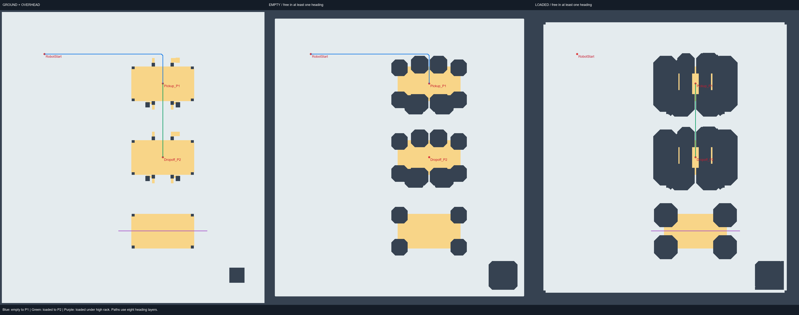

# A* 仿真地图与机器人定义

后续已增加独立规划 CLI、动作段输出和 10 个场景验证，见 [A* 路径规划](ASTAR_PLANNER.md)。

本部分对应项目计划书 5.3–5.5：将已保存的 Unity 仓库转为已知障碍物、语义净空、目标位姿和状态相关规划地图。
当前实现可离线生成并验证路径，没有启动 ROS、发布 `/cmd_vel` 或修改场景中的物体。

## 已交付文件

| 文件 | 用途 |
|---|---|
| `maps/scene_geometry.json` | 从当前 Unity 场景导出的 91 个生效 BoxCollider，保留三维范围、对象路径和障碍类型；包含起点、任务点及机器人尺寸校验数据 |
| `config/planning.json` | 机器人差速参数、三种状态的分层 footprint、载荷朝向、对接规则及状态切换条件 |
| `maps/generated/occupancy.pgm` 与 `.yaml` | 未膨胀地面占据图，覆盖高度 0.02–0.50 m 的实体，不会把上方输送线全部涂成地面障碍 |
| `maps/generated/planning_grids.npz` | 真正规划使用的高度相关、朝向相关布尔地图，以及转向禁止层和净空层 |
| `maps/generated/{empty,raised_empty,loaded}_h0…h7.pgm` 与 `.yaml` | 八个固定朝向的已膨胀配置空间地图，可单独查看 |
| `maps/generated/goals.json` | 起点、P1、P2、通道参考点与对接接近点，全部为 map 坐标 |
| `maps/generated/semantic_zones.json` | 从货架横梁、上层货板和任务点生成的语义标记 |
| `maps/generated/metadata.json` | 分辨率、行列顺序、坐标偏移、场景/config 哈希及各状态对应的场景配置 |
| `maps/generated/demo_paths.json` | 四条参考 A* 路径，每个点有 x、y、yaw；保留原地转向点 |
| `config/temporary_high_block.json` | 在高通道添加临时挡板的离线测试场景，不改 Unity |
| `warehouse_planning/` | 地图构建、障碍覆盖及参考 A* 实现 |

## 坐标、栅格与目标

`map` 以 Unity 世界原点为基准：

```text
map.x = Unity.z
map.y = -Unity.x
map.z = Unity.y
map.yaw = -Unity yaw，弧度

当前起点对应 map→odom 平移 (-6, +7)，旋转为 0：
map.x = odom.x - 6
map.y = odom.y + 7
```

地图范围 x∈[-9,9)、y∈[-10,10)，分辨率 **0.025 m**，720 列 × 800 行。
NumPy 数组为 `[heading, row_y, column_x]`，row=0 在地图下方。PGM 图片行序相反，已在导出时翻转。
栅格中心为 `origin + (index + 0.5) × resolution`，越界拒绝，不能自动截到边界。

| 任务点 | map (x,y,yaw)，米/弧度 | 现有 odom (x,y) |
|---|---|---|
| RobotStart | (-6,7,0) | (0,0) |
| Pickup_P1 | (2,5,-π/2) | (8,-2) |
| Dropoff_P2 | (2,0,-π/2) | (8,-7) |
| PickupSideExit | (2,2.5,-π/2) | (8,-4.5) |
| DropoffApproach | (2,-2.5,-π/2) | (8,-9.5) |

通道参考点不是必须对接的任务目标。演示通行测试为低通道 (-1,5)→(5,5)，高通道 (-1,-5)→(5,-5)，朝向均为 0。
这里只定义 map/odom 关系，尚未发布 TF；不能直接把 map 坐标当作现有 `/odom` 坐标发送。

## 机器人与分层障碍

使用当前模型尺寸，不使用计划书中的早期示例值。质量 40 kg，轮半径 0.18 m，轮距 0.78 m，举升行程 0.35 m。
footprint 的 length 沿机器人前方、width 沿左方，高度相对机器人根节点。

| 状态 | 分层定义 |
|---|---|
| empty | 底盘/轮组 0.90 × 0.956 m，高度 0.02–0.46；收回举升结构 0.72 × 0.62 m，高度 0.46–0.734 |
| raised_empty | 同底盘；举升结构高度扩大到 1.084 m |
| loaded | 同底盘/升高结构；增加 1.70 × 1.40 m 载荷，高度 1.084–1.804 m |

载荷长轴沿机器人前方；在 yaw=-π/2 的取放货姿态，它与 Unity 原容器摆放方向一致。
每一层仅与高度重叠的障碍求平面碰撞，因此可表达：底盘从高于它的轨道下经过、平台从轨道中间镂空槽升起、载货与低横梁碰撞。
这些盒状层是保守几何包络，不含悬架、倾斜、载荷摆动或控制误差模型。保留 **0.02 m** 平面安全余量，另计完整栅格单元的覆盖范围。
输送台支脚间隙很窄，0.05 m 栅格在这个余量下会保守地封死侧向槽口，因此默认采用 0.025 m。

每个状态有八个朝向层：h0=0°、h1=45°，依次到 h7=315°；h6 对应 -90° 对接姿态。
每层按定向矩形和障碍物进行 SAT/Minkowski 碰撞检测，转向层按各高度层的旋转扫掠圆保守检查。
P1/P2 镂空槽内额外禁止原地转向；须在外面先对准，再直行或倒车。

`occupancy.pgm` 只是地面原始地图，单独使用它不能处理载荷高度。
各 `*_h*.pgm` 已包含机器人几何膨胀，表示机器人参考点可否处于该位置；不能再当作原始障碍重复膨胀。
`clearance_m` 为每个格子最低障碍底面，无上方障碍时为 infinity；它仅用于检查/展示，不能替代完整分层碰撞计算。

## 容器状态和临时障碍

初始 `initial` 场景保留 P1 的静态容器；`empty`、`raised_empty` 默认使用它。
`loaded` 使用 `carrying` 场景，仅排除 P1 容器本身，货架、承托轨道、支脚和其余障碍全部保留。
`delivered` 场景会将容器障碍搬到 P2，可以通过 `scene_obstacles(scene, 'delivered')` 构建放货后的地图。

这些是离线假设。只有外部确认连接货物后才能 EMPTY→LOADED，只有 P2 确认放下后才能 LOADED→EMPTY。
本模块没有自动附着、释放或放货状态机；不可用默认 initial 空载地图替代放货后的 delivered 地图。

场景中已有临时障碍按实际位置导出且默认保留。
覆盖文件支持 `disabled_ids`（精确对象路径）与 `additional`（map 三维 min/max）；未知移除 ID、无效范围会报错。
例如只构建高通道被挡住的测试地图：

```bash
python -m warehouse_planning --overrides config/temporary_high_block.json --output maps/high_blocked --no-demo
```

JSON 仅影响输出地图，不移动 Unity 中的静态物体。若要与实际仿真保持一致，应在 Unity 移动障碍、保存场景并重新导出。

## 更新流程

1. 在 Unity 保存 `WarehouseEnvironment.unity`，退出 Play。
2. 执行 `Warehouse Robotics > Export A Star Planning Geometry`。
3. 从仓库根目录运行：

```powershell
.\tools\Build-PlanningMap.ps1 -RunTests
```

脚本优先用系统 Python；本机无系统 Python 时使用已有的本地依赖运行时。其他机器可传 `-Python` 指定解释器。
通用安装/执行方式：

```bash
python -m pip install -r requirements-planning.txt
python -m warehouse_planning
python -m unittest discover -s tests -v
```

导出器只读取已保存的场景，不会重建仓库。遇到非轴对齐或非 BoxCollider 的环境实体会明确报错，避免错误简化。
生成器检查场景 SHA-256 和关键机器人参数；场景有更新时必须重新导出，并检查机器人定义是否需同步。

## 使用地图调用 A*

```python
import json
import numpy as np
from warehouse_planning.grid import Grid
from warehouse_planning.astar import plan

scene = json.load(open('maps/scene_geometry.json', encoding='utf-8'))
grids = np.load('maps/generated/planning_grids.npz')
grid = Grid(scene['bounds'], 0.025)
result = plan(grid, grids['loaded'], grids['loaded_rotation_blocked'],
              [2, 5, -1.5707963267948966], [2, 0, -1.5707963267948966])
# result['poses']: map x, y, yaw；result['states']: col, row, heading
```

参考 A* 状态为 `(col,row,heading)`，采用八方向前进/倒车与原地 ±45° 转向，启发函数为 octile distance；对角移动禁止穿角。
前进代价为距离，倒车为距离 × 1.1，每次转向加 0.18。未实现计划书后续的贴障惩罚、路径平滑、插值或跟踪控制。
输入朝向必须为 45° 整数倍；位置落到所属单元中心，对接端点仍需控制器精调。占据起终点、越界、不可达或超出搜索预算会报错。
不可删除重复位置的转向点，也不可仅用二维 line-of-sight 把载货路径拉直。

## 验证结果与范围

2026-09-11：Unity 导出成功；三状态地图构建成功，参考路径包括 Start→P1、载货 P1→P2、空载低通道贯通、载货高通道贯通。
8 项 unittest 全部通过，覆盖坐标边界、高度/朝向碰撞、禁止穿角、场景状态、临时障碍、图片行翻转，以及对生成路径的独立连续位姿碰撞抽查。
移动和转向边均插值抽查，使用独立的顶点投影 SAT 验证。

目前 P1→P2 沿侧向输送槽就能直达，地图没有强制绕高通道的隔墙。因此该任务不会人为绕行高通道；高通道另有专门的载货贯通测试。
这是当前真实布局的结果。若演示需要取货后必经高通道，需另行调整场景通道连接关系。

所有验证均为离线几何/栅格测试，尚未执行 ROS 路径跟踪或动态物理碰撞测试。
下图的空载/载货面板为“至少一个朝向可用”的投影，仅供观察；实际规划始终使用八个朝向层。


