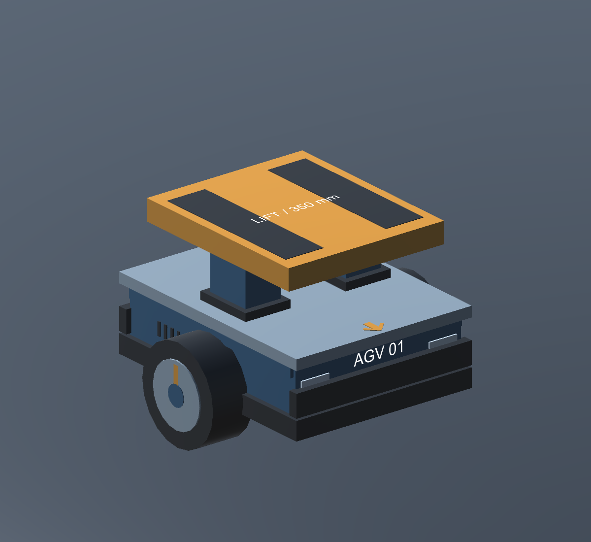
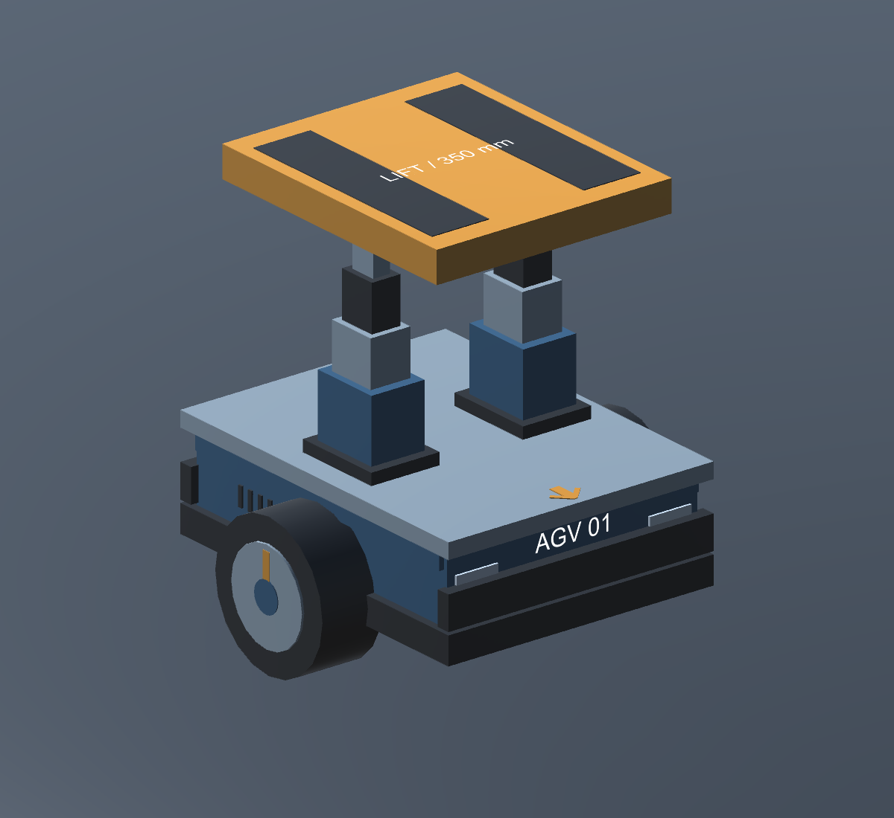

# 实用机器人模型

本次模型优化已同步到 `MinimalRosRobot.unity` 和 `WarehouseEnvironment.unity`。
目标是清楚表达双轮差速、底盘结构、举升行程和承载面，保持现有 ROS 接口。

仓库后续已改为架下贯通货架；新任务点和通行尺寸见 [当前仓库说明](WAREHOUSE_ENVIRONMENT.md)。下方初次建模验证记录属于历史结果，当前生成器使用架下通行与交互侧口检查。

## 模型特征

- 双侧驱动轮：视觉直径从错误的 0.18 m 修正为 0.36 m，与 WheelCollider 半径 0.18 m 一致。轮毂橙色索引随原有控制器的轮姿态更新，方便观察转动和左右差速。
- 低位底盘：深蓝设备壳、黑色下托盘与端部防撞条、金属检修面。它们都位于现有底盘碰撞体范围内。
- 双侧三级伸缩举升柱：跟随 `LiftPlatform` 的实际位置展开，连续显示 0–0.35 m 行程，避免升高后平台悬空。
- 橙色承载平台与两条深色接触面：明确货物支撑区域。接触面是高出原平台 2 mm 的视觉覆盖层，不新增接触物理。
- 前向箭头、前端编号与反光条：区分机器人前后，箭头指向 Unity +Z / ROS +X。

壳体、防撞条、反光条、接触面和伸缩柱属于几何表达；不表示新增碰撞传感器、防撞停车、摩擦模型或电动执行器仿真。

## 尺寸与功能对应

| 参数 | 数值 |
|---|---|
| 底盘实体碰撞体 | 0.70 × 0.28 × 0.90 m |
| 轮半径 / 轮距 | 0.18 / 0.78 m |
| 包含轮毂的视觉总宽 | 约 0.956 m |
| 平台尺寸 | 0.62 × 0.08 × 0.72 m |
| 平台碰撞面收回 / 升满高度 | 0.73 / 1.08 m，相对机器人原点 |
| 平台视觉接触面收回 / 升满高度 | 约 0.732 / 1.082 m |
| 举升行程 | 0.35 m |
| 机器人质量 | 沿用 40 kg |
| 生效碰撞体 | 底盘 BoxCollider、平台 BoxCollider、两个 WheelCollider |

Y 高度是相对机器人根节点的建模值，运行中的悬架沉降会改变世界高度。
模型仍使用现有 X/Z 转动锁定来稳定双轮底盘，没有新增万向轮或倾覆动力学。
伸缩柱由 `LiftMechanismVisual` 读取平台位置更新，不改变 `RosLiftController`。
驾驶轮、速度闭环、编码器发布和 `/cmd_vel`、`/odom` 等接口沿用现有实现。

## 使用和再次生成

直接打开上述任一场景即可。已有自定义场景可在退出 Play 后执行：

`Warehouse Robotics > Optimize Current Robot Model`

该菜单保留当前仓库布局，对活动场景中的机器人执行已有物理轮升级并重建功能外观。
菜单会重置标准机器人几何和物理轮配置；自定义车型应先另存场景。
原有生成机器人、升级物理轮、生成仓库三个入口也会应用同一模型。
自动生成的外观位于 `FunctionalBody`、`LiftPlatform/ContactSurface` 和左右轮的 `WheelDetail`。
原有基础几何仍保留，相关旧 Renderer 被隐藏；基础碰撞体仍由原控制结构管理。

## 验证

2026-09-10，Unity 6000.6.0f1 批处理编译与保存两个场景成功。

- 两个车轮视觉半径与物理半径一致。
- 0–0.35 m 每 0.05 m 采样，伸缩套筒保持重叠且顶部连接平台。
- 活动碰撞体保持四个；重复应用模型不累积对象。
- 实际底盘与平台碰撞体检查：收回时可进入两个门和 P1；升满时与低门、P1 静态货物发生预期重叠，高门保持可通行。
- 收回与升满两张 Unity 近景渲染已检查。

本次未进行 ROS 发布命令后的整段运动联调；P1 货物仍为静态物体，自动连接和释放尚未实现。
升起的平台即使空载也超过 1 m 低门净高，进入低门前需要收回。

