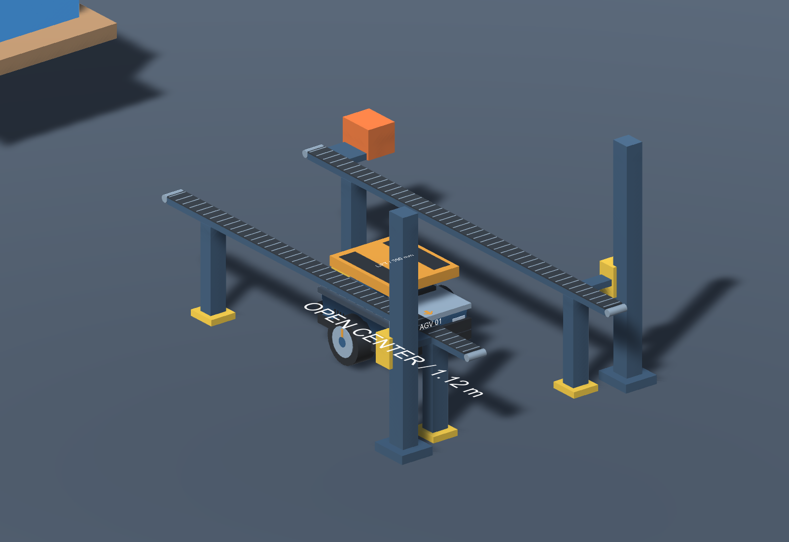
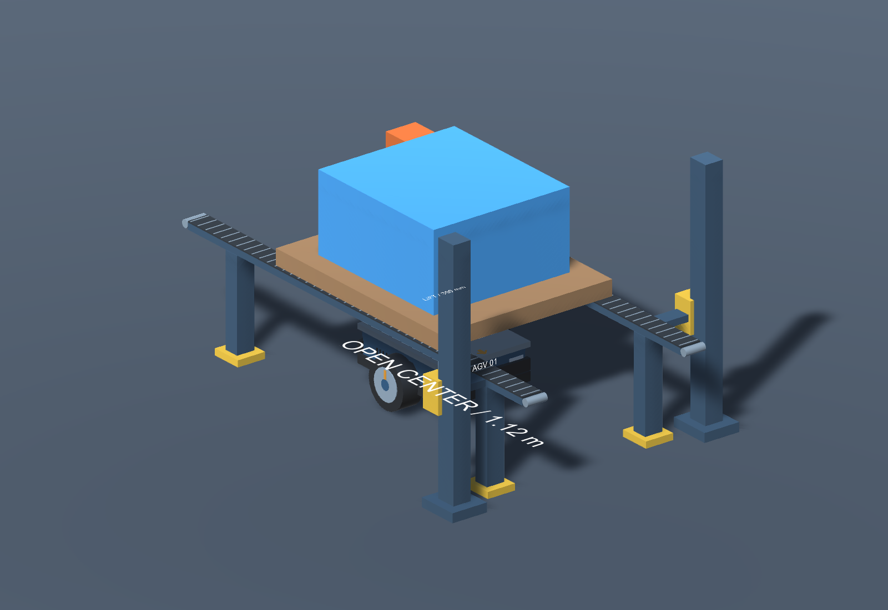

# 静态镂空输送升降台

P1/P2 的原点式托盘支撑已替换成 `StaticOpenCenterConveyorLift`，保存于 `WarehouseEnvironment.unity`。
两条沿 Unity X 方向延伸的履带承托轨道，中间为贯通镂空槽；设备具有履带节、端部滚筒、支腿、升降导轨、固定滑座和驱动外壳。
这些部件均为静态几何，没有 Rigidbody、Animator 或运行脚本；不模拟输送、升降、自动夹紧或容器搬运。

| 尺寸 | 数值 |
|---|---|
| 双轨道长度 | 3.60 m |
| 单轨道宽度 | 0.16 m |
| 轨道中心 | 相对交互点 Z=±0.64 m |
| 中间镂空净宽 | 1.12 m |
| 承托面高度 | 0.82 m |
| 轨道框架底面 | 0.76 m |
| 机器人含轮毂宽度 | 约 0.956 m |
| 平台收回顶面 | 约 0.73 m |

小车以 yaw=90° 沿 X 进入中央槽，平台和车身从两条承托轨道之间通过。
容器托盘为 1.7 × 1.4 m，两侧底部跨在轨道上，每侧名义支撑搭接约 0.14 m。
平台下降到托盘底面低于 0.82 m 后，几何上可与已放置托盘分离，车可收回平台退出。
转向应在槽外完成；轨道下方的纵向低位穿行也保留。

静态布局中 P1 放置样例容器，P2 留空，以展示镂空结构。
按本次要求，除机器人外都保持静态；预览中的放置姿态只是几何示意，场景不会自动执行放货或移动容器。
不应直接把机器人举升平台强行推进静态样例容器。

生成入口仍为 `Warehouse Robotics > Build Warehouse Environment`。
生成器保留架下通道检查，并增加 P2 载货进入、下降及空载退出三阶段共 153 个姿态的静态碰撞检查。
这些验证是几何检测，不是运行时交互演示。

近景图片采用检查视图，临时隐藏周围货架以展示镂空槽；实际保存的场景保留完整货架。履带纹理节高出承托碰撞面约 2 mm，仅为视觉细节。
