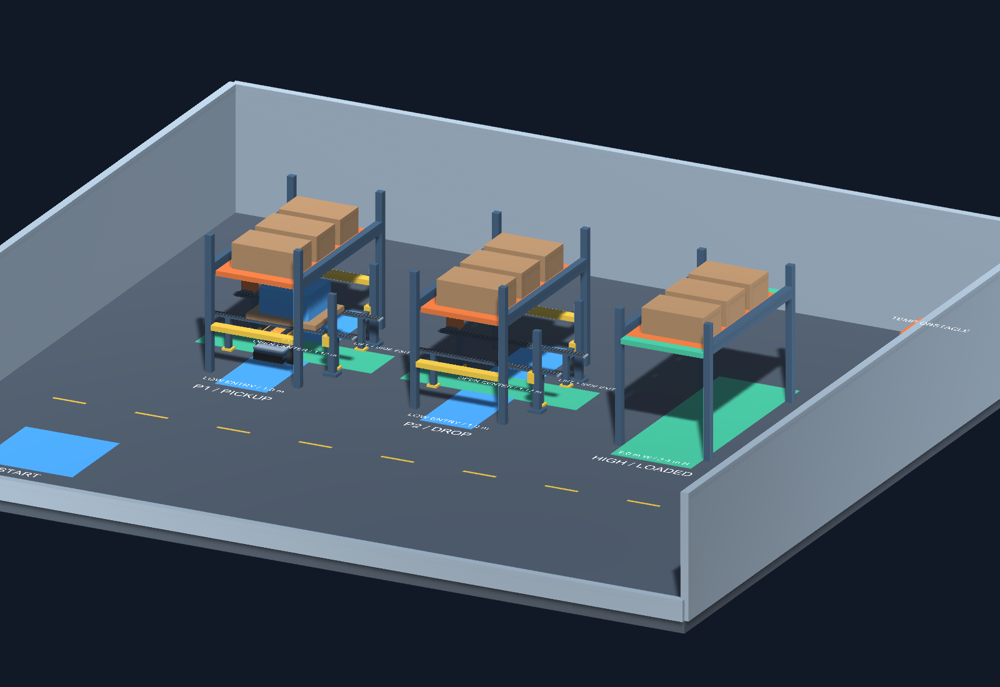
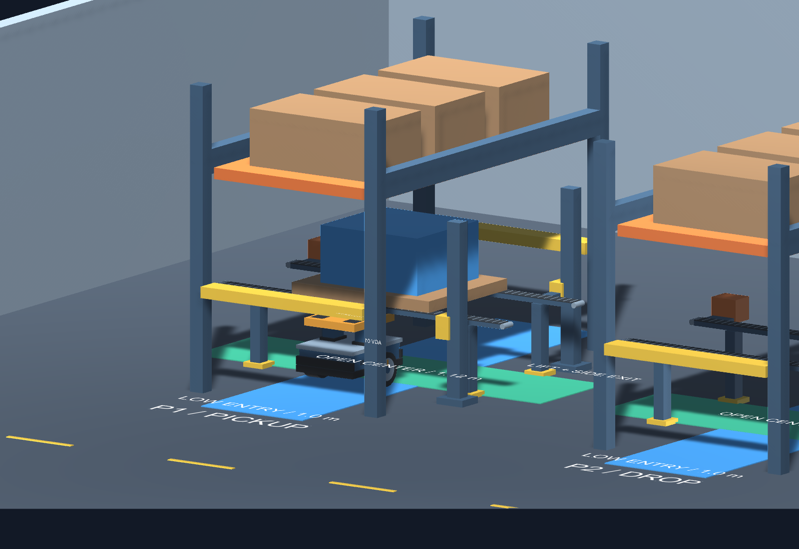
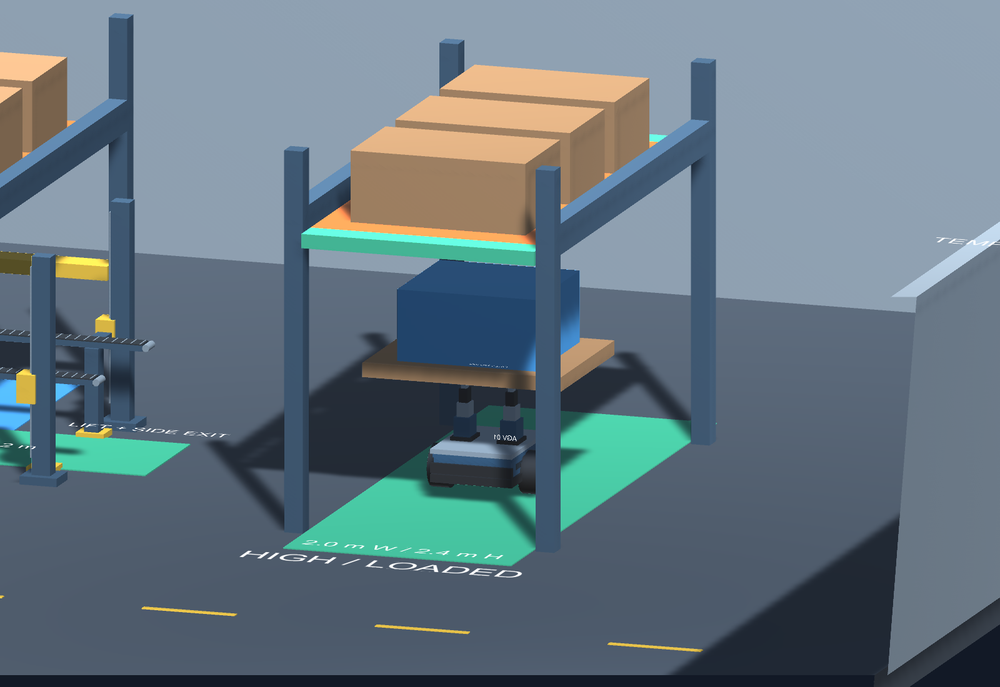

# 架下通行仓库环境

打开 `unity_project/Assets/Scenes/WarehouseEnvironment.unity`。
本版按架下通行需求重建：P1/P2 是带取放货空间的低入口架空货架，第三排是载货贯通货架。
净空限制来自货架本体。场地为 20 × 18 m，保留现有机器人和 ROS 控制接口。

## 两类架下通道

| 特性 | P1/P2 交互货架 | 高净空贯通货架 |
|---|---|---|
| 架下通道方向 | Unity Z，前后贯通 | Unity Z，前后贯通 |
| 入口立柱内宽 | 2.0 m | 2.0 m |
| 入口横梁净高 | 1.0 m | 2.4 m |
| 中央上层货板底面 | 2.2 m | 2.4 m |
| 中央托盘支撑 | 双履带承托轨道，顶面 0.82 m | 无底部支撑或低层货板 |
| 小车穿行净宽 | 纵向穿行保持畅通；横向交互槽宽 1.12 m | 2.0 m |
| 最低穿行净高 | P1 托盘下 0.82 m；P2 空位入口 1.0 m | 2.4 m |
| 升满平台 / 载货通行 | 中央举升后侧向进出，不能穿低入口 | 可沿整排货架底部穿过 |

机器人平台收回时物理顶面约 0.73 m，视觉接触面约 0.732 m；P1 托盘底面 0.82 m，预留约 88 mm 静态几何净空。
升满平台顶面约 1.08 m，加上 0.12 m 托盘和 0.60 m 箱体，总高约 1.80 m，低于高货架 2.4 m 净空。
运行中的悬架沉降会改变世界高度。

## 交互方式

P1 托盘由两条静态履带式轨道承托，小车平台收回时可以从下方穿过。
中央举升区上方不放低横梁，双履带中间没有实心平台或底部横撑；小车可在镂空槽中顶升或下降，再侧向退出。
P2 具有同样的静态输送升降台，初始不放托盘，方便查看中间镂空结构和放货位置。

侧向交互姿态：机器人先在架外转到 Unity yaw=90°，沿 X 方向对准中央侧口进入；不要在双履带槽内原地旋转。
沿 Z 的低入口供最低平台状态的小车穿行。蓝色地带表示低位纵向通道，绿色横向地带表示交互侧口，绿色纵向地带表示高通道。

当前托盘仍是静态几何。这里完成的是交互空间与姿态设计，尚未实现自动货物连接、释放和任务规划。
自动控制接入前，不应直接用升降命令穿入静态托盘。载货预览是临时摆放的几何示意。

## 位置和坐标

1 Unity unit = 1 m，Y 轴向上，初始机器人朝 Unity +Z。

| 对象 / 标记 | Unity 世界位置 (X,Y,Z)，m | 现有 odom 平面 (x,y)，m |
|---|---|---|
| RobotStart | (-7,0,-6) | (0,0) |
| Pickup_P1 | (-5,0,2) | (8,-2) |
| Dropoff_P2 | (0,0,2) | (8,-7) |
| LowGate | (-5,0,0) | (6,-2) |
| HighGate | (5,0,0) | (6,-12) |
| PickupSideExit | (-2.5,0,2) | (8,-4.5) |
| 临时障碍 | (8,0.5,7) | (13,-15) |

三排货架中心依次为 (-5,0,2)、(0,0,2)、(5,0,2)，前后立柱在 Z=0、Z=4。
每排外宽约 2.32 m，立柱高 3.2 m；上层存放箱体，底部不再放整块低层货板。
初始 odom 换算：`odom.x = unity.z + 6`，`odom.y = -(unity.x + 7)`。
尚无 map→odom TF 或导航地图；旧版任务点坐标已变更，外部路径需同步更新。

## 生成和验证

菜单：`Warehouse Robotics > Build Warehouse Environment`。
以已保存的 `MinimalRosRobot.unity` 为机器人来源，重建仓库场景；手工定制建议另存。
批处理入口：`WarehouseRobot.Editor.BuildWarehouseScene.Build`。

本版静态几何检查包括：

- 三条通道从 Z=-1 到 5，每 0.1 m 检查收回机器人包络，每条 61 个位置。
- 高通道整段检查约 1.72 m 宽、1.82 m 高的载货包络。
- 两个低货架前后横梁应阻挡升满平台的包络。
- P1 交互姿态的 0–0.35 m 行程，36 个位置；实际机器人及货物 BoxCollider 对环境检查。
- 载货升高后侧向退出，51 个位置；接触表面采用 0.1 mm 数值容差。
- 机器人起点无环境重叠，保留两个物理驱动轮。

这些是包络和静态碰撞查询，不代表 ROS 驱动或动态搬运测试。执行结果见 `warehouse-validation.txt`。
预览输出到 Unity 工程的 `WarehouseValidation` 目录。

P1/P2 最新交互台尺寸和镂空近景见 [静态输送升降台](STATIC_CONVEYOR.md)。
